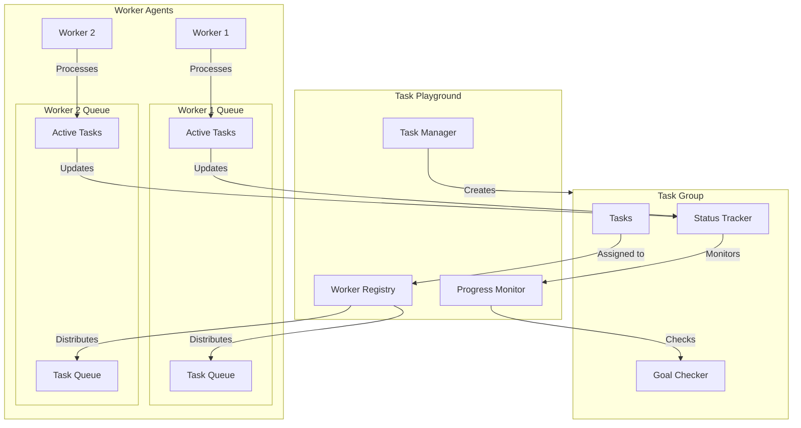

# Building a Distributed Task Processing System with Ceylon

This tutorial will guide you through building a scalable distributed task processing system using Ceylon's TaskPlayGround functionality. The system includes multiple worker agents, task groups, goal-based completion tracking, and comprehensive monitoring.

## Table of Contents
1. [System Overview](#system-overview)
2. [Prerequisites](#prerequisites)
3. [Core Components](#core-components)
4. [Implementation Steps](#implementation-steps)
5. [Running the System](#running-the-system)
6. [Advanced Features](#advanced-features)
7. [Best Practices](#best-practices)
8. [Troubleshooting](#troubleshooting)

## System Overview

### Architecture Diagram



## Prerequisites

1. Python 3.8+
2. Ceylon framework
3. Basic understanding of async programming

```bash
pip install ceylon loguru
```

## Core Components

### 1. TaskProcessor Class

The main class that orchestrates the distributed processing system:

```python
class TaskProcessor:
    def __init__(self, num_workers: int = 2, tasks_per_worker: int = 2):
        self.playground = TaskPlayGround(name="task_processor")
        self.workers = [
            TaskExecutionAgent(
                f"worker{i}", 
                "processor",
                max_concurrent_tasks=tasks_per_worker
            )
            for i in range(num_workers)
        ]
```

### 2. Task Creation

Tasks represent individual units of work:

```python
def create_processing_tasks(self, num_tasks: int) -> List[TaskMessage]:
    return [
        TaskMessage(
            task_id=str(uuid.uuid4()),
            name=f"Process Data Item {i}",
            description=f"Processing task {i}",
            duration=1,
            required_role="processor",
            metadata={"item_number": i}
        )
        for i in range(num_tasks)
    ]
```

### 3. Goal Checker

Monitors task completion and determines when goals are met:

```python
def create_goal_checker(self, required_tasks: int) -> Callable:
    def check_completion(task_groups: Dict[str, TaskGroup],
                       completed_tasks: Dict[str, TaskMessage]) -> bool:
        completed_group_tasks = sum(
            1 for task in completed_tasks.values()
            if hasattr(task, 'group_id') and
            task.group_id in task_groups
        )
        logger.info(f"Progress: {completed_group_tasks}/{required_tasks} tasks completed")
        return completed_group_tasks >= required_tasks

    return check_completion
```

## Implementation Steps

### 1. Initialize the System

```python
# Create TaskProcessor instance
processor = TaskProcessor(
    num_workers=2,
    tasks_per_worker=2
)
```

### 2. Create Task Groups

```python
processing_group = TaskManager.create_task_group(
    name="Data Processing",
    description=f"Process {num_tasks} data items, goal achieves at {required_tasks}",
    subtasks=self.create_processing_tasks(num_tasks),
    goal=TaskGroupGoal(
        name="Partial Processing Complete",
        description=f"Complete at least {required_tasks} processing tasks",
        check_condition=self.create_goal_checker(required_tasks),
        success_message="Successfully completed minimum required tasks!",
        failure_message="Failed to complete minimum required tasks."
    ),
    priority=1
)
```

### 3. Monitor Progress

```python
async def monitor_progress(self, active_playground: TaskPlayGround, 
                         processing_group: TaskGroup) -> None:
    while True:
        await asyncio.sleep(1)
        current_group = active_playground.task_manager.task_groups[processing_group.task_id]

        # Print status updates
        logger.info(f"Group Status: {current_group.status}")
        if current_group.goal:
            logger.info(f"Goal Status: {current_group.goal.status}")

        if (current_group.goal and 
            current_group.goal.status == GoalStatus.ACHIEVED):
            logger.info("Goal achieved! System can stop while tasks continue.")
            break
```

### 4. Run the System

```python
async def run(self, num_tasks: int = 10, required_tasks: int = 5) -> None:
    processing_group = self.create_task_group(num_tasks, required_tasks)

    async with self.playground.play(workers=self.workers) as active_playground:
        await active_playground.assign_task_groups([processing_group])
        await self.monitor_progress(active_playground, processing_group)
        await self.print_statistics(active_playground)
```

## Running the System

### Basic Usage

```python
async def main():
    processor = TaskProcessor(num_workers=2, tasks_per_worker=2)
    await processor.run(num_tasks=10, required_tasks=5)

if __name__ == "__main__":
    asyncio.run(main())
```

### Example Output

```
2025-02-04 10:15:30 | INFO | Starting task processor...
2025-02-04 10:15:30 | INFO | Workers initialized: 2
2025-02-04 10:15:30 | INFO | Tasks created: 10
2025-02-04 10:15:30 | INFO | Required completions: 5

2025-02-04 10:15:31 | INFO | Progress: 2/5 tasks completed
2025-02-04 10:15:32 | INFO | Progress: 4/5 tasks completed
2025-02-04 10:15:33 | INFO | Progress: 5/5 tasks completed
2025-02-04 10:15:33 | INFO | Goal achieved! System can stop while tasks continue.

2025-02-04 10:15:34 | INFO | Final Statistics:
2025-02-04 10:15:34 | INFO | Completed Tasks: 7
2025-02-04 10:15:34 | INFO | Average Duration: 1.2s
```

## Advanced Features

### 1. Custom Task Types

You can extend the system to handle different types of tasks:

```python
@dataclass
class CustomTask(TaskMessage):
    task_type: str
    parameters: Dict[str, Any]
    
def create_custom_task(self, task_type: str, params: Dict[str, Any]) -> CustomTask:
    return CustomTask(
        task_id=str(uuid.uuid4()),
        name=f"Custom {task_type} Task",
        description=f"Execute {task_type} with parameters",
        duration=1,
        required_role="processor",
        task_type=task_type,
        parameters=params
    )
```

### 2. Dynamic Worker Scaling

Implement worker scaling based on load:

```python
async def scale_workers(self, current_load: float, 
                       min_workers: int = 2, max_workers: int = 10):
    target_workers = min(max_workers, 
                        max(min_workers, 
                            int(current_load * 1.5)))
    
    while len(self.workers) < target_workers:
        worker = TaskExecutionAgent(
            f"worker{len(self.workers) + 1}",
            "processor",
            max_concurrent_tasks=self.tasks_per_worker
        )
        self.workers.append(worker)
```

### 3. Task Dependencies

Add task dependencies for complex workflows:

```python
def add_task_dependencies(self, task_group: TaskGroup, 
                         dependencies: Dict[str, List[str]]):
    task_group.dependencies = dependencies
    return task_group
```

## Best Practices

1. **Error Handling**
    - Implement comprehensive error handling
    - Use try-except blocks for task execution
    - Log errors with context

2. **Resource Management**
    - Monitor worker load
    - Implement proper cleanup
    - Use context managers

3. **Performance Optimization**
    - Adjust worker count based on load
    - Configure appropriate task durations
    - Monitor system resources

## Troubleshooting

### Common Issues

1. **Tasks Not Starting**
    - Check worker roles match task requirements
    - Verify worker connection status
    - Check task queue status

2. **Slow Processing**
    - Monitor worker load
    - Adjust concurrent task limits
    - Check for resource bottlenecks

3. **Goals Not Achieving**
    - Verify goal checker logic
    - Check task completion status
    - Monitor progress updates

### Debug Mode

Enable detailed logging:

```python
import logging
logging.basicConfig(level=logging.DEBUG)
logger.enable("ceylon")
```

## Conclusion

This tutorial demonstrated building a robust distributed task processing system using Ceylon. Key takeaways:

1. Modular system design
2. Scalable worker architecture
3. Goal-based completion tracking
4. Comprehensive monitoring
5. Error handling and recovery

For more information, visit:
- Ceylon Documentation: [https://docs.ceylon.ai](https://docs.ceylon.ai)
- GitHub Repository: [https://github.com/ceylon-ai/ceylon](https://github.com/ceylon-ai/ceylon)