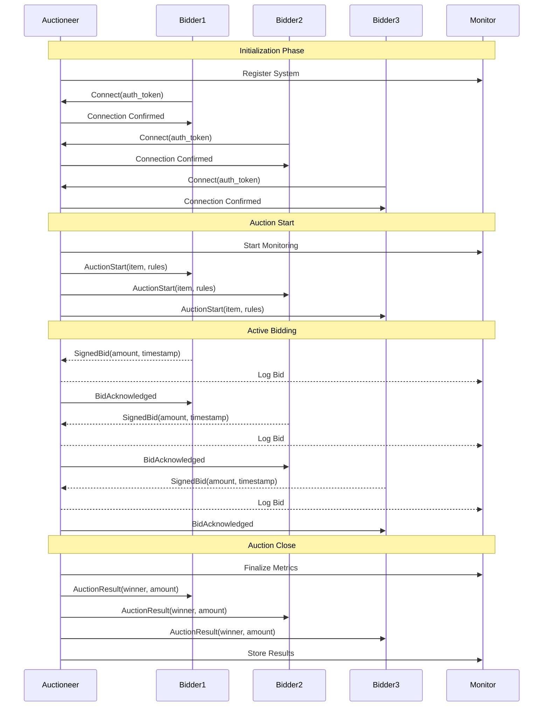

# Distributed Auction System

This tutorial demonstrates building a robust, secure distributed auction system using the Ceylon multi-agent framework. The system implements a scalable architecture with an auctioneer agent orchestrating the auction process and multiple authenticated bidder agents participating in real-time auctions.

## System Overview

The auction system implements:
- Multiple concurrent auction support with isolation
- Secure bid validation and authentication
- Configurable auction rules (reserve price, minimum increment)
- Fault-tolerant communication with automatic recovery
- Scalable bid processing with rate limiting

## Core Components

### Data Models

```python
@dataclass
class Item:
    name: str
    starting_price: float
    reserve_price: Optional[float] = None
    min_increment: float = 1.0
    auction_duration: timedelta = timedelta(minutes=5)

@dataclass
class Bid:
    bidder: str
    amount: float
    timestamp: float
    signature: bytes  # For bid verification
    auction_id: str

@dataclass
class AuctionStart:
    item: Item
    auction_id: str
    start_time: float

@dataclass
class AuctionResult:
    winner: str
    winning_bid: float
    auction_id: str
    end_time: float

@dataclass
class AuctionEnd:
    auction_id: str
    reason: str  # "completed", "reserve_not_met", "cancelled"
```

### Auctioneer Agent

The auctioneer manages multiple concurrent auctions:

```python
class Auctioneer(BaseAgent):
    def __init__(self, name="auctioneer", port=8888):
        super().__init__(
            name=name,
            mode=PeerMode.ADMIN,
            role="auctioneer",
            port=port
        )
        self.active_auctions: Dict[str, AuctionState] = {}
        self.bid_queue = asyncio.Queue(maxsize=1000)
        self.bidder_registry: Dict[str, BidderInfo] = {}
```

Key features:
- Asynchronous bid processing with rate limiting
- Automatic auction timeouts and cleanup
- Bid verification and signature validation
- Bidder reputation tracking
- Comprehensive error handling and recovery

### Bidder Agent

Each bidder implements secure auction participation:

```python
class Bidder(BaseAgent):
    def __init__(self, name: str, budget: float, strategy: BiddingStrategy):
        super().__init__(
            name=name,
            mode=PeerMode.CLIENT,
            role="bidder"
        )
        self.budget = budget
        self.strategy = strategy
        self.active_bids: Dict[str, float] = {}
        self.key_pair = generate_keypair()  # For bid signing
```

Key features:
- Configurable bidding strategies
- Bid signing and verification
- Budget enforcement and tracking
- Automatic bid updates on price changes
- Graceful handling of connection issues

## Advanced Bidding Strategies

```python
class SmartBidder(Bidder):
    async def calculate_bid(self, item: Item, auction_state: AuctionState) -> float:
        market_value = await self.estimate_market_value(item)
        competition = len(auction_state.active_bidders)
        time_remaining = auction_state.end_time - time.time()
        
        if time_remaining < 60:  # Last minute strategy
            return min(self.budget, market_value * 1.1)
        
        return min(
            self.budget,
            market_value * (0.8 + (0.4 * (1 - time_remaining/auction_state.duration)))
        )
```

## Error Handling and Recovery

```python
class AuctionManager:
    async def handle_disconnection(self, bidder_id: str):
        affected_auctions = self.find_affected_auctions(bidder_id)
        for auction in affected_auctions:
            if auction.status == "pending_payment":
                await self.revert_auction(auction.id)
            else:
                await self.pause_auction(auction.id)
                await self.notify_participants(auction.id, "auction_paused")

    async def recover_auction_state(self, auction_id: str):
        state = await self.load_backup_state(auction_id)
        await self.verify_bid_sequence(state.bids)
        await self.resume_auction(state)
```

## Running the System

1. Initialize auction system with configuration:
```python
config = AuctionConfig(
    min_bidders=3,
    bid_timeout=30,
    max_concurrent_auctions=10,
    bid_verification_required=True
)
auctioneer = Auctioneer(config)
```

2. Create authenticated bidders:
```python
bidders = [
    SmartBidder("Alice", 1500.0, MarketValueStrategy()),
    SmartBidder("Bob", 1200.0, AggressiveStrategy()),
    SmartBidder("Charlie", 2000.0, ConservativeStrategy())
]
```

3. Start the system with monitoring:
```python
async with AuctionMonitor() as monitor:
    await auctioneer.start_agent(b"", bidders)
    await monitor.track_metrics()
```

## System Architecture



## Performance Monitoring

The system includes built-in monitoring for:
- Bid processing latency
- Message queue depths
- Bidder connection health
- Auction completion rates
- System resource utilization

## Security Considerations

1. Bid Authentication
- All bids are cryptographically signed
- Timestamps prevent replay attacks
- Rate limiting prevents DoS attacks

2. Data Integrity
- Auction state is regularly checkpointed
- Bid history is immutable and verifiable
- Transaction logs for audit trails

3. Access Control
- Bidder authentication required
- Role-based permissions
- Resource usage quotas

## Scalability Features

1. Horizontal Scaling
- Multiple auctioneer instances
- Load-balanced bidder connections
- Distributed state management

2. Performance Optimization
- Asynchronous bid processing
- Efficient state management
- Connection pooling
- Message batching