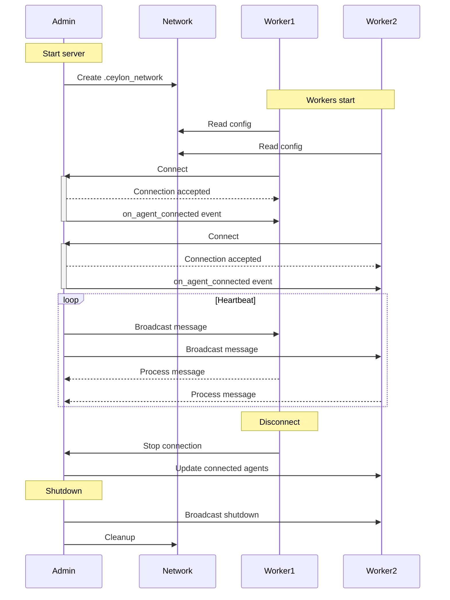

# Remote Agents

## System Components

### 1. Server (server.py)

```python
from ceylon import Admin, enable_log
from loguru import logger

enable_log("INFO")
app = Admin(
    name="admin",
    port=8888,
    role="admin",
    workspace_id="default"
)


@app.on_run()
async def run_worker(inputs: bytes):
    logger.info(f"Worker started - {app.details().name}")
    while True:
        try:
            message = {"type": "heartbeat", "source": app.details().name}
            await app.broadcast_message(message)
            await asyncio.sleep(1)  # Prevent CPU spinning
        except Exception as e:
            logger.error(f"Error in broadcast: {e}")
```

The server implements a heartbeat system and proper error handling.

### 2. Worker (worker_agent.py)

```python
from ceylon import Worker, AgentDetail, enable_log
from loguru import logger

enable_log("INFO")
worker = Worker(
    name="worker",
    role="worker",
    workspace_id="default"
)


@worker.on(dict)
async def on_message(agent: AgentDetail, data: dict, time: int):
    try:
        logger.info(f"Message from {agent.name}: {data}")
        if data.get("type") == "heartbeat":
            # Handle heartbeat
            pass
    except Exception as e:
        logger.error(f"Error processing message: {e}")


@worker.on_connect("*")
async def on_connect(topic: str, agent: AgentDetail):
    logger.info(f"Connected to {agent.name} on {topic}")
```

Workers implement proper message handling and connection events.

### 3. Configuration (.ceylon_network)

```ini
WORKSPACE_ID=default
WORKSPACE_IP=127.0.0.1
WORKSPACE_PORT=8888
WORKSPACE_BUFFER_SIZE=1024
```

## Setup Instructions

1. Start the Server:
   ```bash
   python server.py
   ```
    - Creates .ceylon_network with auto-generated configuration
    - Initializes message handlers and event system

2. Start Worker(s):
   ```bash
   python worker_agent.py
   ```
    - Connects using configuration from .ceylon_network
    - Establishes bidirectional communication

## Remote Connection Setup

1. Configure Network:
    - Open required ports on firewall
    - Set up secure network tunneling if needed
    - Update WORKSPACE_IP to server's external IP

2. Security Considerations:
    - Use environment-specific configuration files
    - Implement proper access controls
    - Monitor connections and traffic

## Network Configuration

- Default settings in static_val.py:
    - Port: DEFAULT_WORKSPACE_PORT (8888)
    - Buffer: DEFAULT_WORKSPACE_BUFFER_SIZE (100)
    - Workspace: DEFAULT_WORKSPACE_ID

## Common Issues & Solutions

1. Connection Issues:
    - Verify network connectivity
    - Check configuration file paths
    - Enable DEBUG logging for troubleshooting
    - Validate port accessibility

2. System Performance:
    - Monitor buffer sizes
    - Implement rate limiting if needed
    - Use appropriate logging levels

## Production Guidelines

1. Security:
    - Use secure configuration management
    - Implement authentication
    - Enable network encryption
    - Regular security audits

2. Monitoring:
    - Implement health checks
    - Set up logging aggregation
    - Monitor system metrics
    - Establish alerting

## System Interaction Flow

