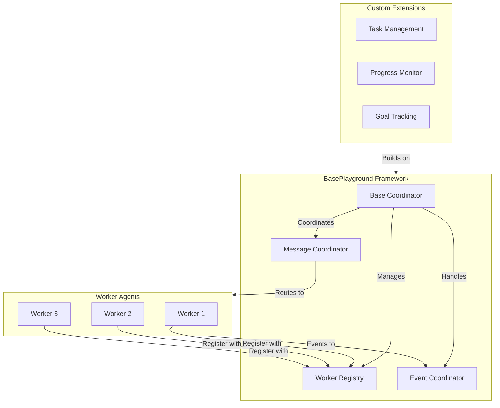
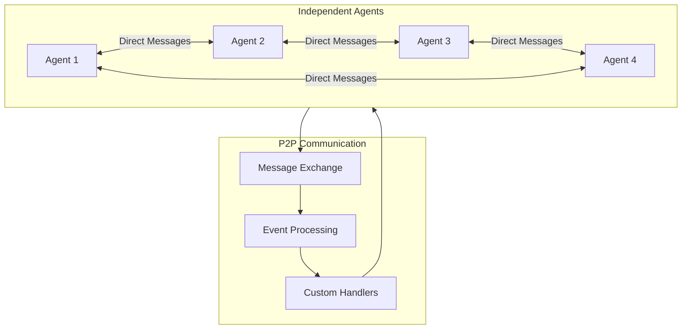

# Ceylon Architecture Approaches

## 1. BasePlayground Approach (Base Framework)



## 2. Direct Agent Approach



## Key Differences

### BasePlayground Framework
- **Foundation Layer**: Provides base coordination and communication infrastructure
- **Extensible Design**: Can be extended with custom features like task management
- **Structured Communication**: Centralized message and event coordination
- **Registration Management**: Built-in worker registration and tracking

### Direct Agent Approach
- **Pure P2P**: Direct agent-to-agent communication
- **Flexible Architecture**: No predefined structure
- **Custom Protocols**: Define your own message formats and protocols
- **Independent Agents**: Each agent operates autonomously

## Implementation Examples

### 1. Task Management System using BasePlayground
```python
class TaskPlayGround(BasePlayGround):
    def __init__(self):
        super().__init__()
        self.task_manager = TaskManager()  # Custom implementation
        self.progress_monitor = ProgressMonitor()  # Custom implementation

    async def assign_tasks(self, tasks):
        # Custom task distribution logic
        pass
```

### 2. Direct Agent System
```python
class DirectAgent(BaseAgent):
    def __init__(self):
        super().__init__()
        self.message_handlers = {}  # Custom message handling
        self.state_manager = StateManager()  # Custom state management

    async def send_direct(self, target, message):
        # Direct P2P communication
        pass
```

## When to Use Each

### BasePlayground When:
- Need structured agent coordination
- Want to build on existing communication infrastructure
- Planning to implement custom task/work management
- Need centralized event handling

### Direct Agents When:
- Need pure P2P communication
- Want maximum flexibility
- Implementing custom protocols
- Building specialized agent behaviors

## Implementation Pattern Examples:
1. Meeting Scheduling
2. Auction Systems
3. Task Processing
4. Distributed Computing

Each example can be implemented using either approach, with the choice depending on specific requirements for structure vs flexibility.