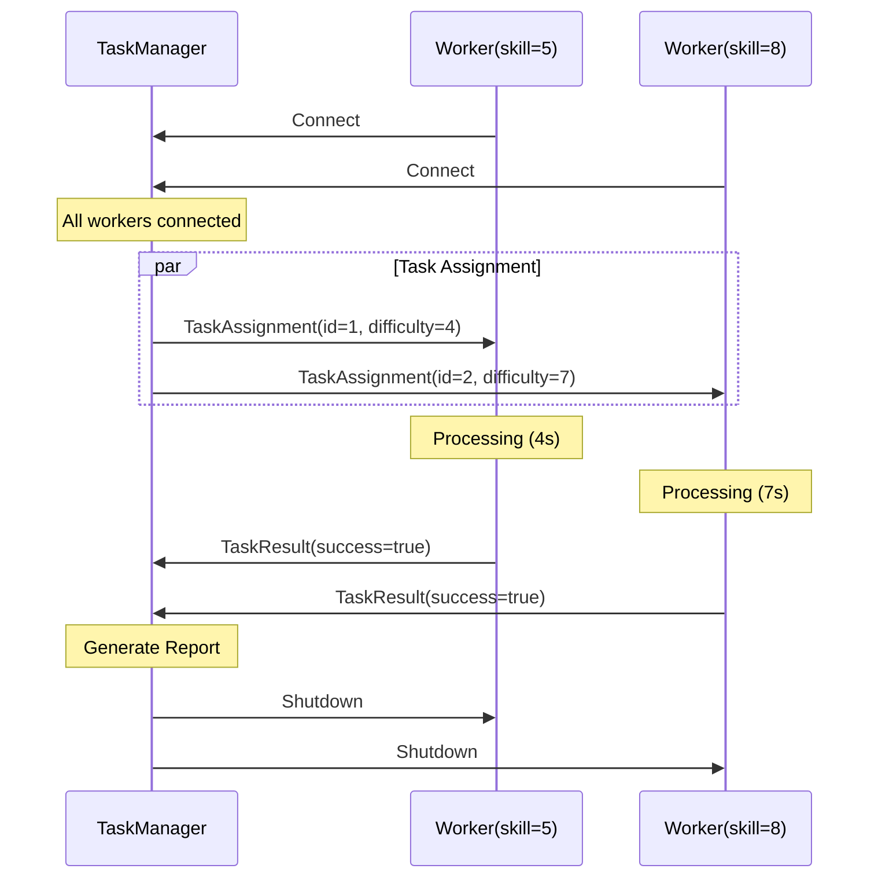
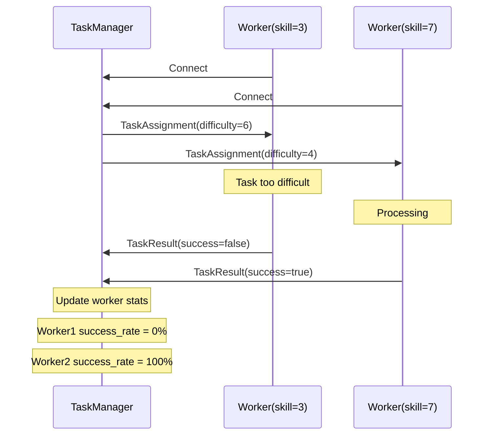
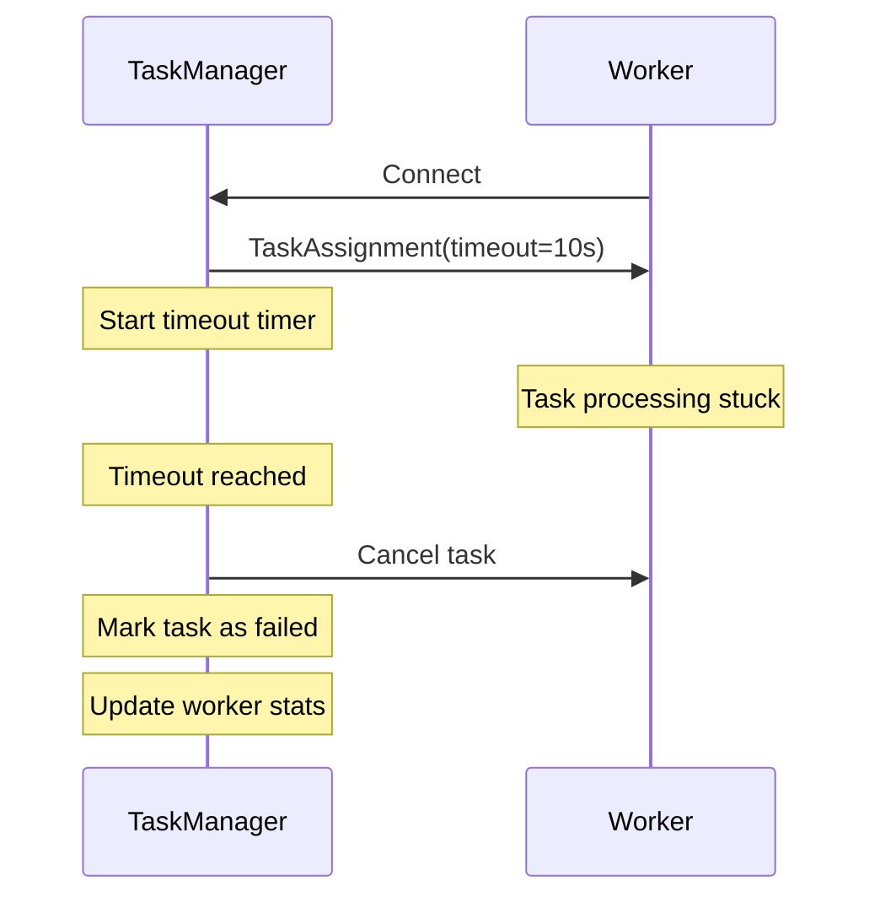

# Distributed Task Management System

## System Architecture

### Core Components
1. Task Manager (Admin Node)
   - Task distribution controller
   - Worker state management
   - Result aggregation

2. Worker Nodes
   - Task execution
   - Progress reporting
   - Skill-based routing

3. Message Protocol
   - Task assignments
   - Status updates
   - Completion reports

## Implementation Details

### 1. Data Models

```python
from dataclasses import dataclass
from typing import List, Optional

@dataclass
class Task:
    id: int
    description: str
    difficulty: int
    
    def validate(self) -> bool:
        return 1 <= self.difficulty <= 10

@dataclass
class TaskAssignment:
    task: Task
    assigned_at: int  # Unix timestamp
    timeout: Optional[int] = None

@dataclass
class TaskResult:
    task_id: int
    worker: str
    success: bool
    execution_time: float
    error_message: Optional[str] = None
```

### 2. Enhanced Worker Implementation

```python
class WorkerAgent(BaseAgent):
    def __init__(self, name: str, skill_level: int,
                 workspace_id=DEFAULT_WORKSPACE_ID,
                 admin_peer=""):
        self.name = name
        self.skill_level = skill_level
        self.has_task = False
        self.current_task: Optional[Task] = None
        self.task_history: List[TaskResult] = []
        
        super().__init__(
            name=name,
            workspace_id=workspace_id,
            admin_peer=admin_peer,
            mode=PeerMode.CLIENT
        )

    @on(TaskAssignment)
    async def handle_task(self, data: TaskAssignment, 
                         time: int, agent: AgentDetail):
        try:
            if self.has_task:
                logger.warning(f"Worker {self.name} already has task")
                return

            self.has_task = True
            self.current_task = data.task
            start_time = time.time()

            # Simulate work with proper error handling
            try:
                await asyncio.sleep(data.task.difficulty)
                success = self.skill_level >= data.task.difficulty
            except asyncio.CancelledError:
                success = False
                error_msg = "Task cancelled"
            
            execution_time = time.time() - start_time
            
            result = TaskResult(
                task_id=data.task.id,
                worker=self.name,
                success=success,
                execution_time=execution_time,
                error_message=error_msg if not success else None
            )
            
            self.task_history.append(result)
            await self.broadcast(pickle.dumps(result))
            
        except Exception as e:
            logger.error(f"Error in task handling: {e}")
            # Send failure result
        finally:
            self.has_task = False
            self.current_task = None

    @on_connect("*")  
    async def handle_connection(self, topic: str, 
                              agent: AgentDetail):
        logger.info(f"Connected to {agent.name} on {topic}")
```

### 3. Task Manager Implementation

```python
class TaskManager(BaseAgent):
    def __init__(self, tasks: List[Task], expected_workers: int,
                 name="task_manager", port=8000):
        super().__init__(
            name=name,
            port=port,
            mode=PeerMode.ADMIN,
            role="task_manager"
        )
        self.tasks = tasks
        self.expected_workers = expected_workers
        self.task_results = []
        self.tasks_assigned = False
        self.worker_stats = {}
        self.task_timeouts = {}

    async def assign_tasks(self):
        if self.tasks_assigned:
            return

        self.tasks_assigned = True
        connected_workers = await self.get_connected_agents()
        
        # Intelligent task distribution
        worker_tasks = self._match_tasks_to_workers(
            self.tasks, connected_workers)
        
        for worker, task in worker_tasks:
            assignment = TaskAssignment(
                task=task,
                assigned_at=int(time.time()),
                timeout=task.difficulty * 2
            )
            await self.broadcast(pickle.dumps(assignment))
            
            # Set timeout handler
            self.task_timeouts[task.id] = asyncio.create_task(
                self._handle_timeout(task.id, assignment.timeout)
            )

    async def _handle_timeout(self, task_id: int, timeout: int):
        await asyncio.sleep(timeout)
        if task_id not in self.completed_tasks:
            logger.warning(f"Task {task_id} timed out")
            # Implement timeout handling

    def _match_tasks_to_workers(self, tasks, workers):
        # Intelligent matching algorithm
        matches = []
        sorted_tasks = sorted(tasks, 
                            key=lambda t: t.difficulty,
                            reverse=True)
        sorted_workers = sorted(workers,
                              key=lambda w: self._get_worker_score(w))
        
        for task, worker in zip(sorted_tasks, sorted_workers):
            matches.append((worker, task))
        return matches

    def _get_worker_score(self, worker):
        stats = self.worker_stats.get(worker.name, {})
        success_rate = stats.get('success_rate', 0.5)
        completed_tasks = stats.get('completed_tasks', 0)
        return success_rate * 0.7 + completed_tasks * 0.3

    @on(TaskResult)
    async def handle_result(self, data: TaskResult, 
                          time: int, agent: AgentDetail):
        # Cancel timeout handler
        if data.task_id in self.task_timeouts:
            self.task_timeouts[data.task_id].cancel()
            
        self.task_results.append(data)
        self._update_worker_stats(data)
        
        if len(self.task_results) == len(self.tasks):
            await self._generate_final_report()
            await self.end_task_management()

    def _update_worker_stats(self, result: TaskResult):
        if result.worker not in self.worker_stats:
            self.worker_stats[result.worker] = {
                'completed_tasks': 0,
                'successful_tasks': 0,
                'total_time': 0
            }
            
        stats = self.worker_stats[result.worker]
        stats['completed_tasks'] += 1
        if result.success:
            stats['successful_tasks'] += 1
        stats['total_time'] += result.execution_time
        stats['success_rate'] = (stats['successful_tasks'] / 
                               stats['completed_tasks'])
```

## System Flow Diagrams

### 1. Normal Operation Flow


### 2. Error Handling Flow


### 3. Timeout Handling


## Best Practices and Error Handling

1. Task Validation
```python
def validate_task(task: Task) -> bool:
    return (1 <= task.difficulty <= 10 and
            task.description.strip() and
            task.id > 0)
```

2. Worker Health Monitoring
```python
async def check_worker_health(worker: WorkerAgent):
    while True:
        try:
            await worker.ping()
            await asyncio.sleep(30)
        except ConnectionError:
            logger.error(f"Worker {worker.name} disconnected")
```

3. Task Recovery
```python
async def recover_failed_task(task: Task, 
                            result: TaskResult):
    if result.success:
        return
        
    available_workers = [w for w in workers 
                        if not w.has_task]
    if not available_workers:
        logger.error("No workers available for recovery")
        return
        
    # Select best worker for recovery
    worker = max(available_workers,
                key=lambda w: w.skill_level)
    await reassign_task(task, worker)
```

## Performance Optimization

1. Task Batching
```python
async def batch_assign_tasks(tasks: List[Task], 
                           batch_size: int = 3):
    for batch in chunks(tasks, batch_size):
        await asyncio.gather(
            *[assign_task(t) for t in batch]
        )
```

2. Worker Scaling
```python
async def scale_workers(current_load: float,
                       target_load: float = 0.7):
    if current_load > target_load:
        await spawn_new_worker()
    elif current_load < target_load * 0.5:
        await remove_idle_worker()
```

## Monitoring and Metrics

1. System Metrics
```python
class SystemMetrics:
    def __init__(self):
        self.task_completion_times = []
        self.worker_utilization = {}
        self.error_counts = defaultdict(int)
        
    async def collect_metrics(self):
        while True:
            self.update_metrics()
            await asyncio.sleep(60)
```

2. Performance Reporting
```python
def generate_performance_report():
    avg_completion_time = sum(completion_times) / len(completion_times)
    worker_success_rates = {
        w: stats['success_rate']
        for w, stats in worker_stats.items()
    }
    return PerformanceReport(
        avg_completion_time=avg_completion_time,
        worker_stats=worker_success_rates,
        error_rates=error_counts
    )
```