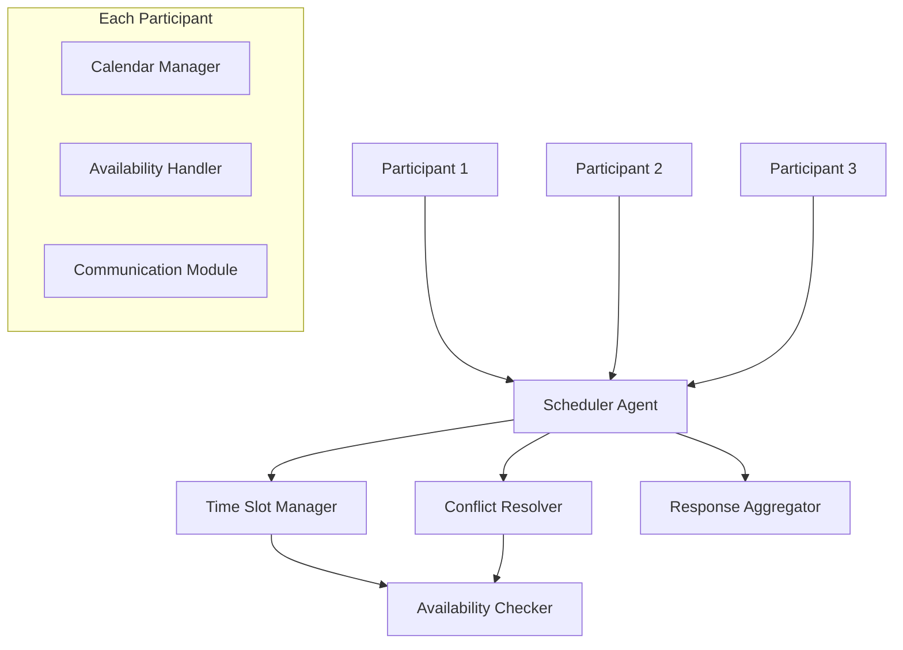
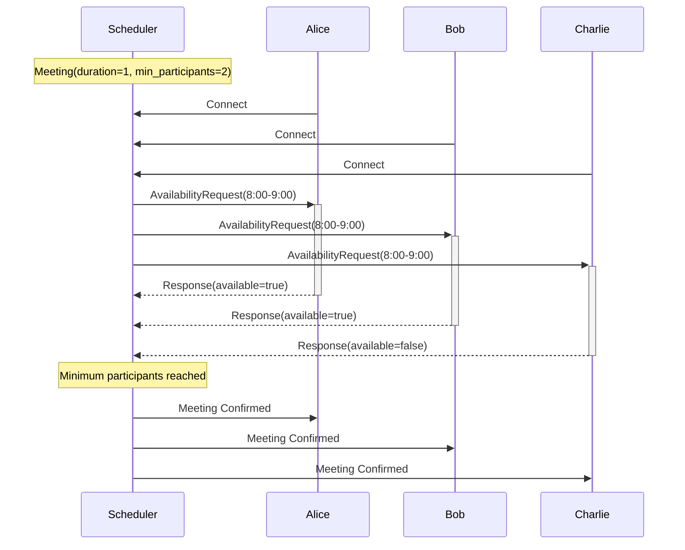
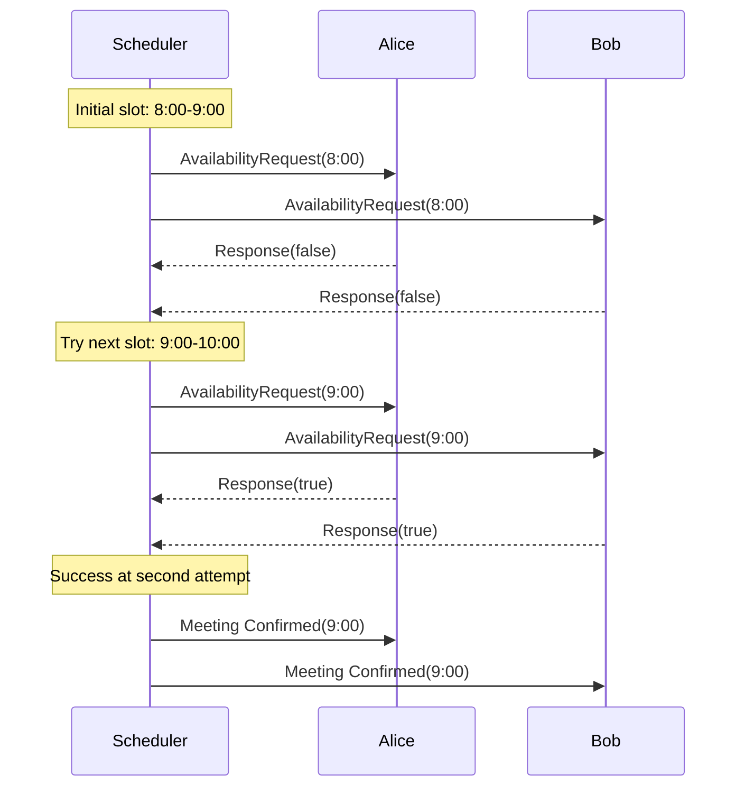
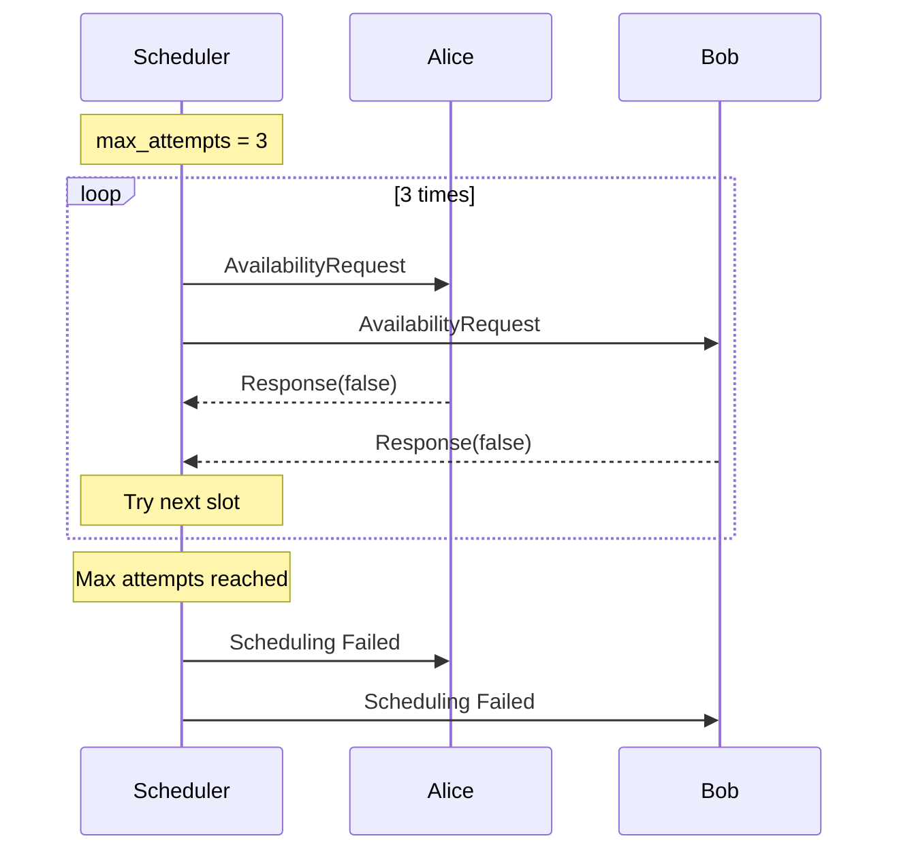
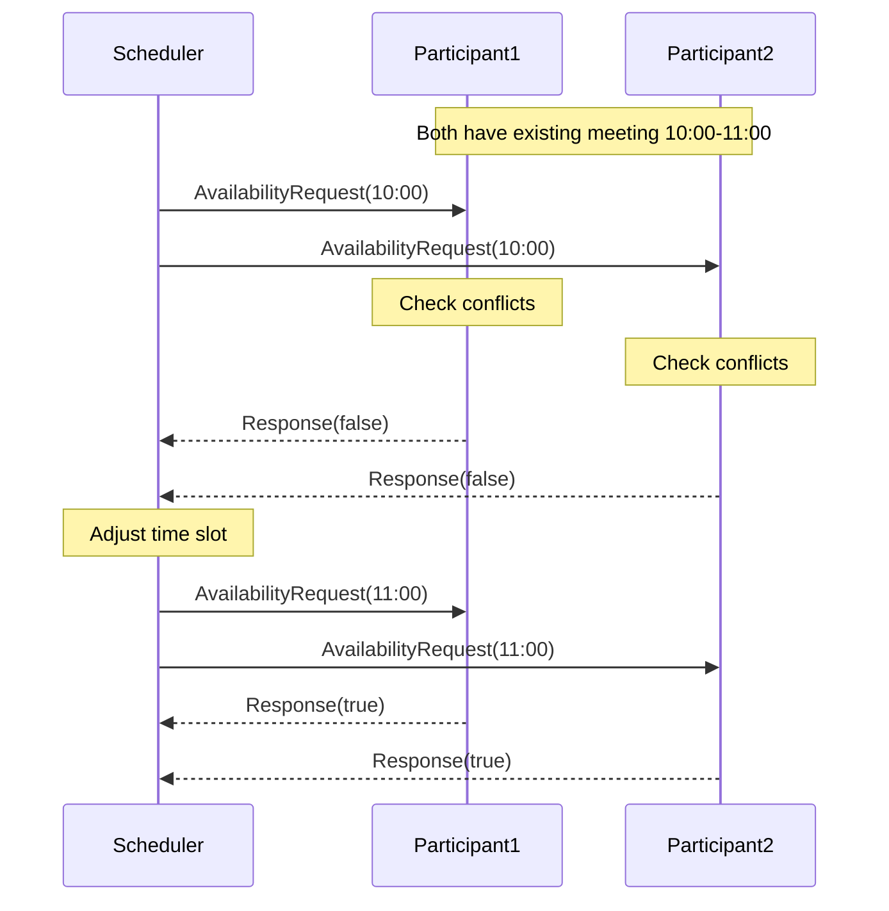

# Distributed Meeting Scheduler

## System Overview

This tutorial demonstrates building a distributed meeting scheduling system using Ceylon's agent-based architecture. The system efficiently coordinates meeting times across multiple participants while handling real-world scheduling complexities.

### What We'll Build

A distributed system that:
1. Coordinates meeting schedules across multiple participants
2. Finds optimal meeting times based on availability
3. Handles scheduling conflicts and constraints
4. Manages concurrent scheduling requests
5. Provides real-time responses and updates

### Key Features

- **Distributed Processing**: Each participant runs as an independent agent
- **Automated Negotiation**: System automatically finds suitable time slots
- **Conflict Resolution**: Handles overlapping meetings and time conflicts
- **Scalable Architecture**: Easily add or remove participants
- **Fault Tolerance**: Handles participant disconnections and failures

### Architecture Diagram


### System Components

1. **Scheduler Agent**
    - Coordinates the scheduling process
    - Manages participant responses
    - Implements scheduling algorithms

2. **Participant Agents**
    - Manage individual availability
    - Handle meeting requests
    - Track scheduled meetings

3. **Communication Protocol**
    - Availability requests/responses
    - Meeting confirmations
    - Schedule updates

4. **Business Logic**
    - Time slot validation
    - Conflict detection
    - Priority handling

## Core Components

### Data Models
```python
@dataclass
class TimeSlot:
    date: str
    start_time: int  # 24-hour format (0-23)
    end_time: int

    def __hash__(self):
        return hash((self.date, self.start_time, self.end_time))

    def validate(self) -> bool:
        return (0 <= self.start_time < 24 and
                0 <= self.end_time <= 24 and
                self.start_time < self.end_time)

@dataclass
class Meeting:
    name: str
    date: str
    duration: int
    minimum_participants: int
    priority: int = 1

    def validate(self) -> bool:
        return (self.duration > 0 and
                self.minimum_participants > 0 and
                self.priority > 0)

@dataclass
class SchedulingResult:
    meeting: Meeting
    time_slot: TimeSlot
    participants: List[str]
    status: str
    error_message: Optional[str] = None
```

### Enhanced Participant Implementation
```python
class Participant(Worker):
    def __init__(self, name: str, available_times: List[TimeSlot],
                 admin_peer: str):
        self.name = name
        self.available_times = self._validate_times(available_times)
        self.scheduled_meetings: Dict[str, TimeSlot] = {}
        super().__init__(name=name, admin_peer=admin_peer)

    def _validate_times(self, times: List[TimeSlot]) -> List[TimeSlot]:
        return [t for t in times if t.validate()]

    @on(AvailabilityRequest)
    async def handle_request(self, data: AvailabilityRequest,
                             time: int, agent: AgentDetail):
        try:
            is_available = self._check_availability(
                data.time_slot, data.time_slot.duration)

            response = AvailabilityResponse(
                participant=self.name,
                time_slot=data.time_slot,
                available=is_available
            )
            await self.broadcast_message(response)

        except Exception as e:
            logger.error(f"Error checking availability: {e}")

    def _check_availability(self, slot: TimeSlot,
                            duration: int) -> bool:
        # Check conflicts with scheduled meetings
        if any(self._has_conflict(slot, scheduled_slot)
               for scheduled_slot in self.scheduled_meetings.values()):
            return False

        # Check if slot fits in available times
        return any(self._fits_in_slot(slot, available_slot, duration)
                   for available_slot in self.available_times)

    @staticmethod
    def _has_conflict(slot1: TimeSlot, slot2: TimeSlot) -> bool:
        return (slot1.date == slot2.date and
                slot1.start_time < slot2.end_time and
                slot2.start_time < slot1.end_time)

    @staticmethod
    def _fits_in_slot(slot: TimeSlot, available: TimeSlot,
                      duration: int) -> bool:
        if slot.date != available.date:
            return False
        latest_start = max(slot.start_time, available.start_time)
        earliest_end = min(slot.end_time, available.end_time)
        return earliest_end - latest_start >= duration
```

### Enhanced Scheduler Implementation
```python
class Scheduler(Admin):
    def __init__(self, meeting: Meeting):
        super().__init__(name="scheduler")
        self.meeting = meeting
        self.agreed_slots: Dict[TimeSlot, List[str]] = {}
        self.current_slot: Optional[TimeSlot] = None
        self.max_attempts = 10
        self.attempt_count = 0

    @on_connect("*")
    async def handle_connection(self, topic: str, agent: AgentDetail):
        if not self.current_slot:
            self.current_slot = TimeSlot(
                self.meeting.date,
                8,  # Start at 8 AM
                8 + self.meeting.duration
            )
            await self._try_schedule()

    async def _try_schedule(self):
        if self.attempt_count >= self.max_attempts:
            await self._handle_scheduling_failure()
            return

        self.attempt_count += 1
        await self.broadcast_message(
            AvailabilityRequest(time_slot=self.current_slot)
        )

    @on(AvailabilityResponse)
    async def handle_response(self, data: AvailabilityResponse,
                              time: int, agent: AgentDetail):
        if not data.available:
            await self._try_next_slot()
            return

        slot_key = f"{data.time_slot.date}_{data.time_slot.start_time}"
        if slot_key not in self.agreed_slots:
            self.agreed_slots[slot_key] = []

        if data.participant not in self.agreed_slots[slot_key]:
            self.agreed_slots[slot_key].append(data.participant)

        if len(self.agreed_slots[slot_key]) >= self.meeting.minimum_participants:
            await self._finalize_meeting(slot_key)

    async def _try_next_slot(self):
        next_slot = TimeSlot(
            self.meeting.date,
            self.current_slot.start_time + 1,
            self.current_slot.start_time + 1 + self.meeting.duration
        )

        if next_slot.end_time > 17:  # Don't schedule after 5 PM
            await self._handle_scheduling_failure()
            return

        self.current_slot = next_slot
        await self._try_schedule()

    async def _finalize_meeting(self, slot_key):
        participants = self.agreed_slots[slot_key]
        print(f"Meeting scheduled at {slot_key}")
        print(f"Participants: {', '.join(participants)}")
        await self.stop()

    async def _handle_scheduling_failure(self):
        print("Failed to find suitable time slot")
        await self.stop()
```

## Scheduling Scenarios

### 1. Successful First Attempt


### 2. Multiple Attempts


### 3. Scheduling Failure


### 4. Conflict Resolution


## Error Handling and Recovery

1. Participant Disconnection:
```python
@on_disconnect
async def handle_disconnection(self, agent: AgentDetail):
    # Remove from current slot agreements
    for participants in self.agreed_slots.values():
        if agent.name in participants:
            participants.remove(agent.name)

    # Retry current slot if minimum participants lost
    if self.current_slot:
        await self._try_schedule()
```

2. Invalid Time Slots:
```python
def validate_time_slot(slot: TimeSlot) -> bool:
    if not slot.validate():
        return False

    # Business hours check (8 AM - 5 PM)
    if not (8 <= slot.start_time <= 17 and
            8 <= slot.end_time <= 17):
        return False

    # Weekend check
    date_obj = datetime.strptime(slot.date, "%Y-%m-%d")
    if date_obj.weekday() >= 5:
        return False

    return True
```

3. Scheduling Timeout:
```python
async def schedule_with_timeout(self, timeout: int = 300):
    try:
        async with asyncio.timeout(timeout):
            await self._try_schedule()
    except asyncio.TimeoutError:
        await self._handle_scheduling_failure()
```

## System Extensions

1. Priority-based Scheduling:
```python
class PriorityScheduler(Scheduler):
    def __init__(self, meetings: List[Meeting]):
        self.meetings = sorted(
            meetings,
            key=lambda m: m.priority,
            reverse=True
        )
```

2. Recurring Meetings:
```python
@dataclass
class RecurringMeeting(Meeting):
    frequency: str  # "daily", "weekly", "monthly"
    end_date: str

    def generate_instances(self) -> List[Meeting]:
        instances = []
        current = datetime.strptime(self.date, "%Y-%m-%d")
        end = datetime.strptime(self.end_date, "%Y-%m-%d")

        while current <= end:
            instances.append(Meeting(
                name=self.name,
                date=current.strftime("%Y-%m-%d"),
                duration=self.duration,
                minimum_participants=self.minimum_participants
            ))

            if self.frequency == "daily":
                current += timedelta(days=1)
            elif self.frequency == "weekly":
                current += timedelta(weeks=1)
            elif self.frequency == "monthly":
                current = current.replace(
                    month=current.month % 12 + 1,
                    year=current.year + current.month // 12
                )

        return instances
```